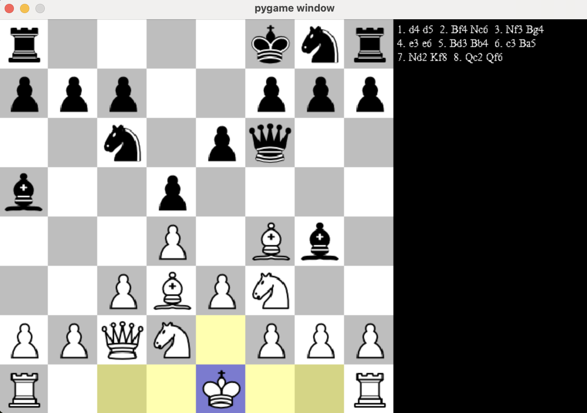

# ♟️ Chess Engine in Python

A fully-featured Python chess engine and GUI that supports all legal moves, complete game logic, and a working AI opponent powered by **negamax** and **alpha‑beta pruning**.

---

## Features:

-  Full legal move generation (castling, en passant, pawn promotion)
-  AI with **negamax** and **alpha‑beta pruning**
-  Move ordering for improved pruning efficiency
-  Move ordering for improved pruning efficiency
-  Evaluation using:
      - Piece values
      - Piece‑square tables
      - Checkmate & stalemate detection
-  Undo/redo functionality
-  Player vs AI and AI vs AI modes
-  GUI built with Pygame

---

## GUI Preview

Here’s an in-game snapshot of the GUI:

---
